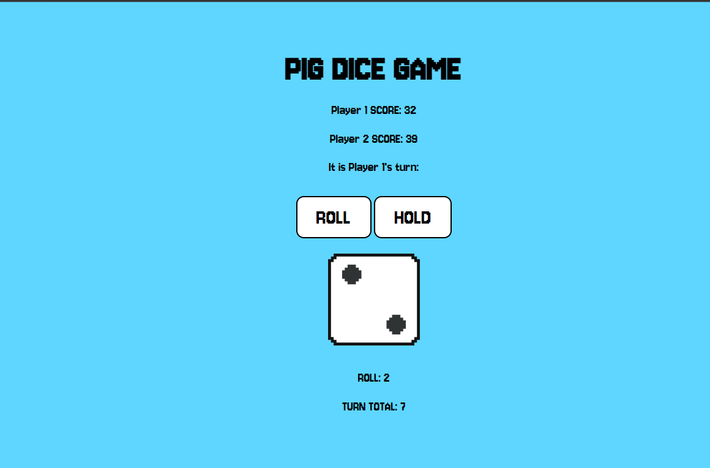

# Pig Dice Game

Two-player dice game web app with server-side per-user game state.
**[Play it live](https://pig-game-2-0.onrender.com)**

## Tech Stack
Python · Flask · SQLite · Docker · Gunicorn · Deployed on Render

## Features
- Per-user server-side game state (Flask signed-cookie sessions, Post/Redirect/Get pattern)
- Game history persisted in SQLite with parameterized queries (SQL-injection safe)
- Fully containerized — builds and runs with a single Docker command

## Run Locally

With Docker (recommended):
    docker build -t pig-game .
    docker run -p 5000:5000 pig-game
    # then open http://localhost:5000

Or with Python:
    python -m venv venv
    venv\Scripts\activate
    pip install -r requirements.txt
    python app.py

## Authors
Pavlo Vysotin, Brice Moeller